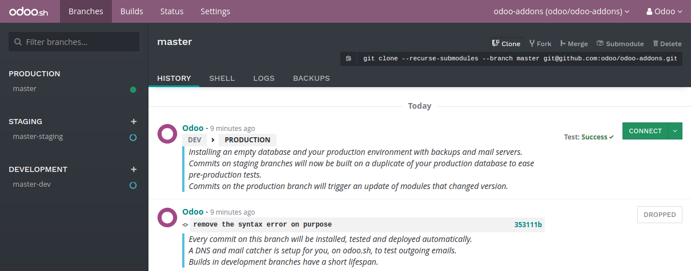

:banner: banners/odoo-sh.jpg

==================================
The interface
==================================

Branches
============

Overview
---------

The branches view gives you an overview of the different branches your repository has.

Branches stages
-----------------

Odoo.sh offers three different stages for your branches: production, staging and development.

You can change the stage of a branch by drag and dropping it on the stage section title.

Production
**********
This is the branch holding the code on which your production database run.
There can be only one production branch.

When you push a new commit in this branch,
your production server is updated with the code of the new revision and is then restarted.

If your changes require the update of a module, such as for a change in a form view,
and you want it to be performed automatically,
increase the version number of the module in its manifest.
The platform will then take care to perform the update.

In the case the changes in the commit prevent the server to restart,
or the modules update fails,
the server is automatically roll-backed to the previous successful code revision.
Nevertheless, you have access to the logs of the failed updates so you can analyze what happened.

Staging
*******
Staging branches are meant to test your new features using the production data.

When you push a new commit in one of these branches,
a new server is started, using a duplicate of the production database and the new revision of the branch.

You can therefore test your latest features using the production data without compromising the actual
production database with test records.

The outgoing emails are not sent: They are intercepted by the mailcatcher,
which provides an interface to preview the emails sent by your database.
That way, you do not have to worry about sending test emails to your contacts.

The databases created for staging branches are meant to live at least two weeks.
After that, they can be garbage collected automatically.
If you make configuration changes or view changes in these branches, make sure to document them or write them directly
in the modules of the branch, using XML data files overriding the default configuration or views.

Development
***********
Development branches creates new databases using the demo data and running the unit tests.

When you push a new commit in one of these branches,
a new server is started, with a database created from scratch and the new revision of the branch.
The demo data is loaded, and the unit tests are performed.

You can therefore verify your changes do not break any of the unit tests,
and therefore any of the features tested thanks to them.

As for staging branches, the emails are not sent: They are intercepted by the mailcatcher.

The databases created for development branches are meant to live at least three days.
After that, they can be garbage collected automatically.

Merging your branches
*********************
You can merge your branches easily by drag and dropping them on each other.

When you want to test the changes of your development branches with the production data,
you can either:

* merge the development branch into your staging branch, by drag and dropping it onto the desired staging branch,
* drag and dropping the development branch on the staging section title, to make it become a staging branch.

When your latest changes are ready for production,
you can drag and drop your staging branch onto your production branch
to merge and deploy in production your newest revisions.

If you are bold enough,
you can merge your development branches into your production branch as well.
It just means you skip the validation of your changes with the production data through a staging branch.

You can merge your development branches into each other, and your staging branches into each other.

Of course, you can also use git directly to merge your branches.
Odoo.sh will be notified new revisions have been pushed in your branches.

Branches tabs
-------------

History
*******
An overview of your branch history:

* The messages of the commits and their authors,
* The various events linked to the platform, such as stage changes, database imports, backup restores.

For each event, a status is displayed in the above right corner.
It can provide information about the ongoing operation on the database (installation, update, backup import, ...),
or its result (tests feedback, successful backup import, ...).
When an operation is successful, you also got
the possibility to access the database thanks to the *connect* button.

Mails
*****
A preview of the emails sent by your database. This is available only for your development and staging branches,
as the emails of your production database are really sent instead of being intercepted.

Shell
*****
A shell access to your container. You can perform basic linux command (:kbd:`ls`, :kbd:`top`)
and open a shell on your database by typing :kbd:`psql`.

Logs
****
A viewer to have a look to your server logs.

Different logs are available:

* install.log: The logs of the database installation. In a development branch, the logs of the tests is included.
* pip.log: The logs of the Python dependencies installation.
* odoo.log: The logs of the running server.
* update.log: The logs of the database updates. This is available only for the production database.

If new lines are added in the logs, they will be displayed automatically.
If you scroll to the bottom, the browser will scroll automatically each time a new line is added.

You can pause the logs fetching by clicking on the according button in the upper right corner of the view.
The fetching is automatically stopped after 5 minutes. You can restart it using the play button.

Backups
*******
A list of the backups available for download and restore, as well as the possibility to import a database.

The list contains the backups kept on the server your production database is hosted on.
This server only keeps one month of backups: 7 daily and 4 weekly backups.

Dedicated backups servers keep the same backups, as well as 3 additional monthly backups.
To restore or download one of these monthly backups, please `contact us <https://www.odoo.com/help>`_.

The *import database* feature accepts database archives in the format provided by the standard Odoo database manager
(available for on-premise Odoo servers under :kbd:`/web/database/manager`)
or by the Odoo.sh backup download feature.

Builds
============

Status
============

Settings
============
